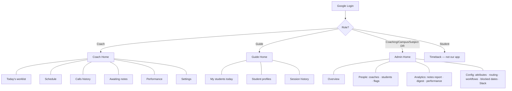
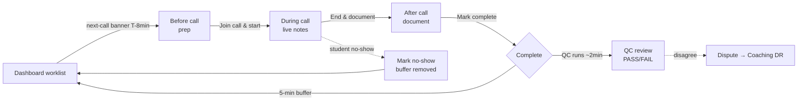
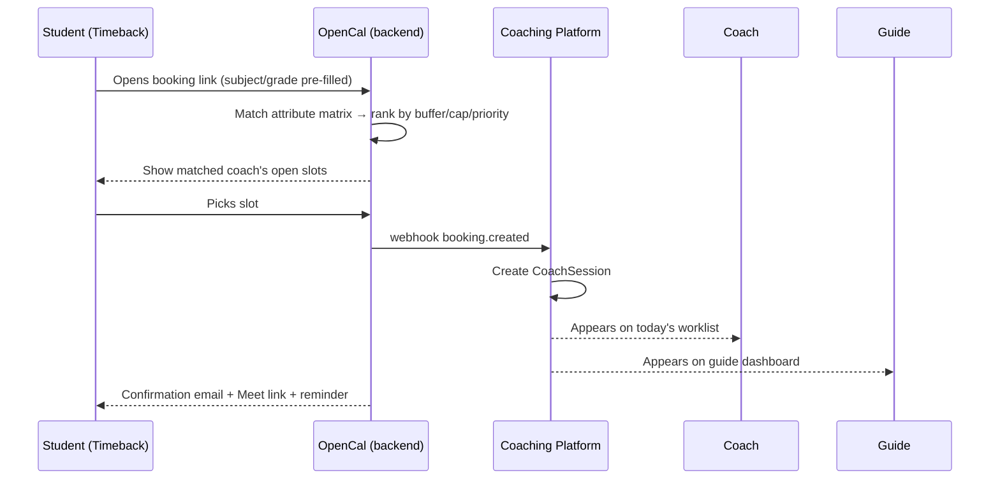
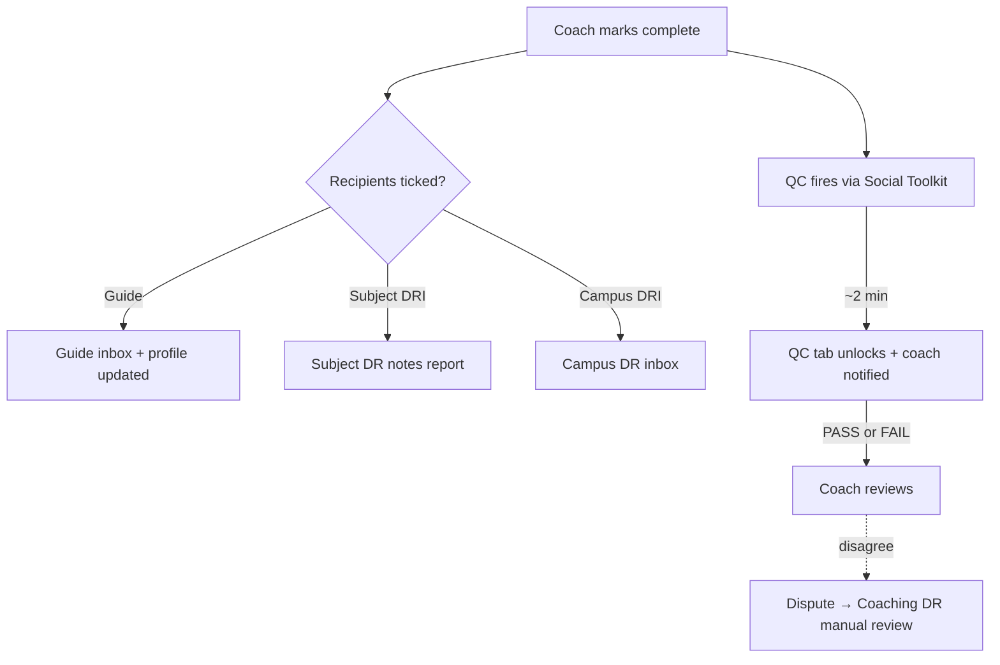
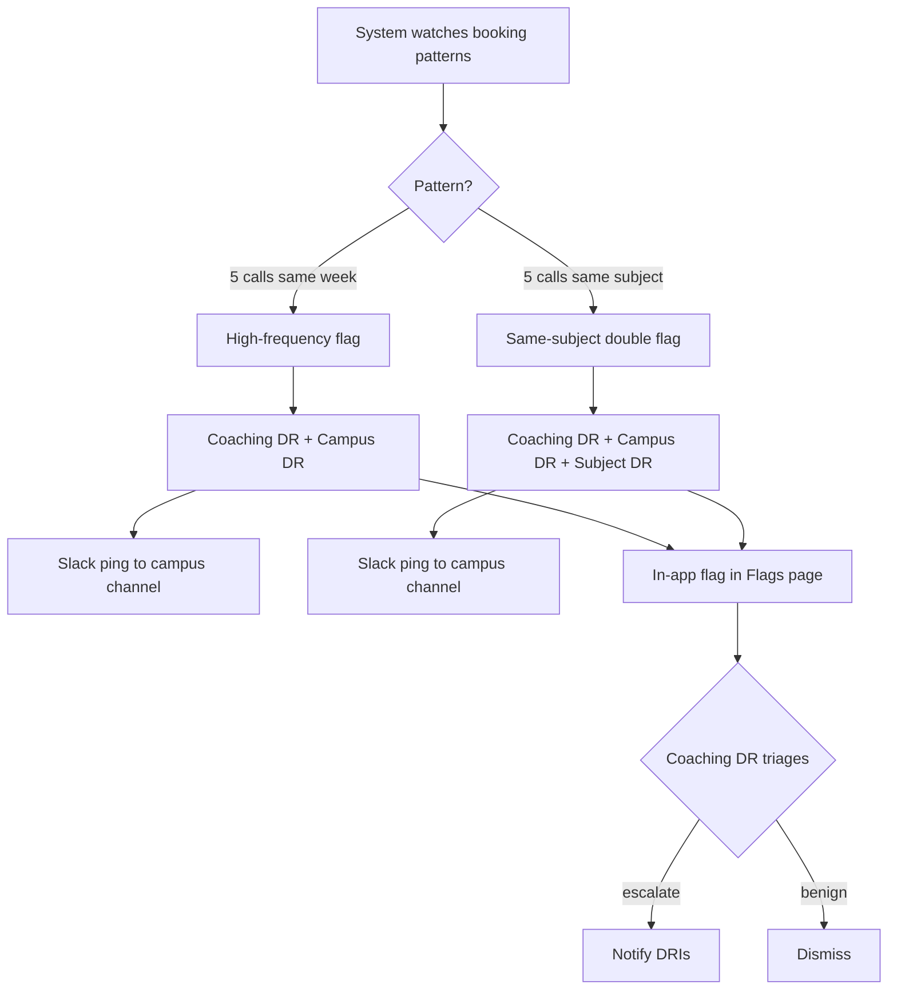
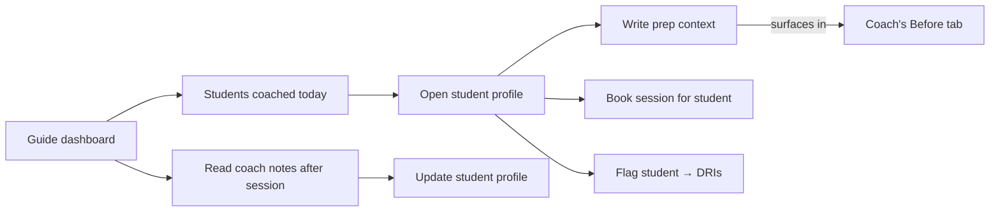
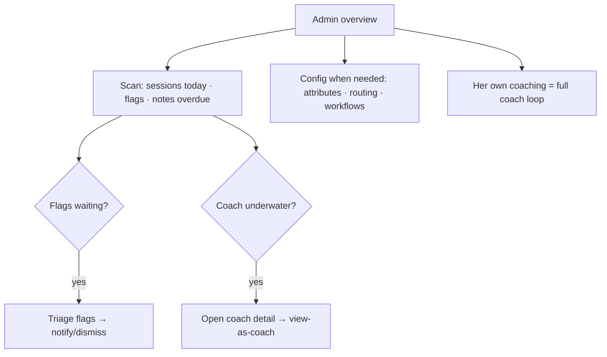

# Alpha Coaching Platform — User Flows

One platform, four roles. OpenCal is the scheduling backend (invisible to users); everything below happens inside the coaching dashboard. Students never log in — they book from Timeback and meet coaches in Google Meet.

---

## 1. Information Architecture (sitemap)

What each role sees in the sidebar. The sidebar is **labeled and always visible** — no hidden icons.

---

## 2. The Coach Session Loop (the core — 90% of a coach's time)

This is a **pipeline**, not a set of tabs. Each session moves Before → During → After → QC with a clear forward action at every step.

**Step detail:**

| Phase | Coach does | System does | Forward action |
|---|---|---|---|
| **Before** | Reads AI summary, alerts (doom-loop, RIT, grade gap), guide + campus-DR notes, history. Writes prep notes. | Pulls student snapshot from Timeback, assembles context. | **Join call & start →** |
| **During** | Takes live notes. Can message guide. | Holds quick actions (no-show / reschedule / cancel / flag). | **End call & document →** |
| **After** | Session objective, recording URL, skill, notes, recommendations. Picks recipients. | — | **Mark complete →** |
| **QC** | Reviews PASS/FAIL + criteria + clips. | Social Toolkit analyses recording. | Share clip / Dispute |

---

## 3. Booking → Session (cross-system ripple)

How a session appears on a coach's worklist in the first place.

Guide-initiated booking (Flow G4) enters the same pipe one step later — guide picks slot inside AVC, which calls OpenCal.

---

## 4. Notes dispatch + QC (what happens on "Mark complete")

---

## 5. Flag fan-out (auto-detection → escalation)

---

## 6. Guide flow

---

## 7. Admin / Coaching DR daily flow

---

## 8. Navigation principles (why it feels fluid)

1. **Orient** — labeled sidebar always visible; breadcrumb in topbar shows `Section / Page / Item`.
2. **Momentum** — every screen has one primary next action; dashboards are worklists that pull you through the day.
3. **Continuity** — student/coach names are clickable everywhere; "back" returns to where you came from; no dead-ends — empty states point to the next thing.
